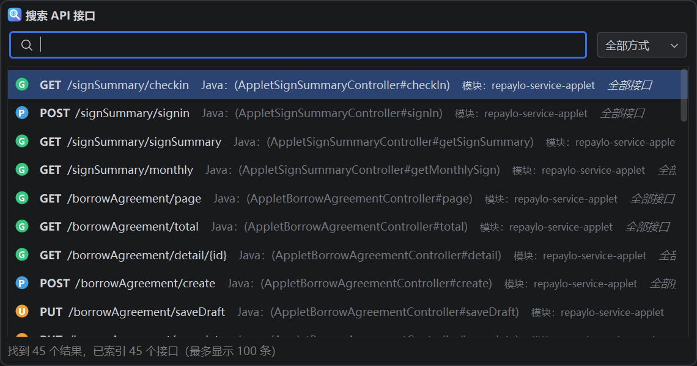
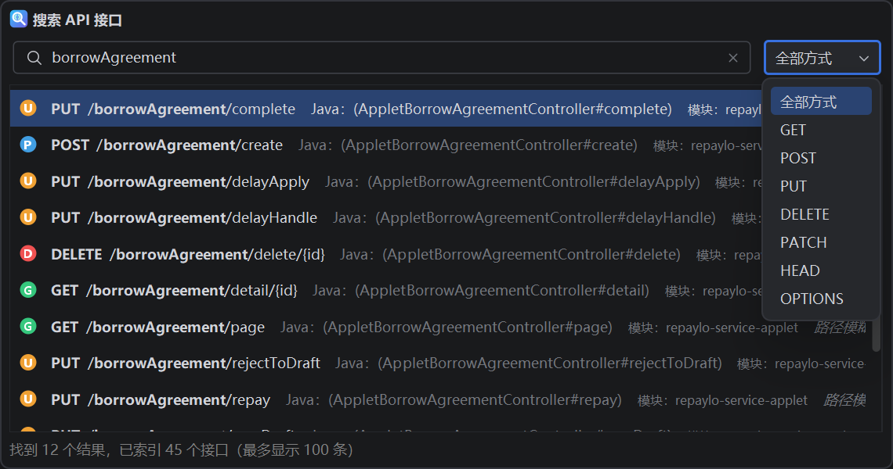

<p align="center">
  
</p>

<h1 align="center">Grep API</h1>

<p align="center">
  Search Spring API endpoints by URL and jump directly to the mapping declaration in IntelliJ IDEA.<br>
  在 IntelliJ IDEA 中根据 URL 快速搜索 Spring API，并直接跳转到接口声明。
</p>

<p align="center">
  
  
  
</p>

<p align="center">
  <a href="#简体中文">简体中文</a> · <a href="#english">English</a>
</p>

---

## 简体中文

### 简介

Grep API 是一款轻量的 IntelliJ IDEA 插件，用于在 Java Spring 项目中根据 URL、路径片段、HTTP 请求方式、Controller、Java 方法名或模块名搜索 API 接口，并精确跳转到对应的 Mapping 源码位置。

插件仅分析本地项目源码，不上传项目代码，不依赖外部服务。

### 界面预览

搜索项目中的全部接口：



模糊搜索并按 HTTP 请求方式筛选：



### 主要功能

- 使用 `Ctrl + Alt + /` 快速打开 API 搜索窗口。
- 支持完整 URL、URL 路径、curl 命令和 `HTTP_METHOD + URL`。
- 支持路径、Controller、Java 方法名和模块名模糊搜索。
- 输入以 `/` 开头的路径时采用严格连续匹配，避免无关结果干扰。
- 仅为路径中实际命中的文字添加背景色，提供蓝、绿、橙、紫四套亮色/暗色主题。
- 支持 GET、POST、PUT、DELETE、PATCH、HEAD、OPTIONS 请求方式筛选。
- 支持 `@RequestMapping`、`@GetMapping`、`@PostMapping`、`@PutMapping`、`@DeleteMapping`、`@PatchMapping`。
- 自动合并 Controller 类级路径和方法级路径。
- 支持 `{id}`、`{id:\\d+}`、`*`、`**` 等路径变量和通配符。
- 支持可配置的网关、服务名前缀。
- 使用上下键选择结果，按 Enter 或双击直接跳转源码。
- 后台增量缓存，只重新分析发生变化的 Java 文件。
- 最多渲染 100 条搜索结果，降低大型项目中的内存占用。

### 兼容范围

| 项目 | 支持范围 |
| --- | --- |
| IntelliJ IDEA | 2024.1 至 2026.x，Community / Ultimate |
| IntelliJ Platform Build | `241` 及以上 |
| Java | Java 17 及以上 |
| 项目语言 | Java |
| Web 框架 | Spring MVC / Spring WebFlux 注解式 Controller |

插件以 IntelliJ IDEA 2024.1 和 Java 17 为最低编译基线，并已在 IDEA 2024.1、IDEA 2026.1.1 上完成编译和测试。

暂不支持 Kotlin Controller、Spring Functional Routing、Ktor、JAX-RS 和自定义组合 Mapping 注解。

### 安装

#### 从 JetBrains Marketplace 安装

插件发布后，在 IDEA 中进入：

```text
Settings → Plugins → Marketplace → 搜索 Grep API
```

#### 从本地 ZIP 安装

1. 下载 `GrepApi-0.0.1.zip`。
2. 打开 `Settings → Plugins`。
3. 点击齿轮按钮，选择 `Install Plugin from Disk...`。
4. 选择 ZIP 文件，不要解压。
5. 根据 IDEA 提示重启。

### 使用

打开 Java Spring 项目，等待 IDEA 索引完成，然后按：

```text
Ctrl + Alt + /
```

也可以通过 `Navigate → 搜索 API 接口...` 打开。

支持的搜索示例：

```text
/api/users/123
GET /api/users/123
borrowAgreement
https://api.example.com/gateway/user-service/api/users/123?detail=true
curl -X POST "https://api.example.com/api/users"
```

使用上下键选择结果，按 Enter 或双击结果即可打开 Controller，并定位、选中对应 Mapping 声明。

### 配置网关前缀

打开：

```text
Settings → Tools → Grep API
```

每行填写一个需要忽略的前缀，例如：

```text
/gateway/user-service
/prod/user-service
```

插件不会擅自删除 URL 路径片段，只有这里明确配置的前缀才会被忽略。

同一设置页可以选择匹配文字背景色，并通过 `confirm` 预览效果。保存后重新打开搜索窗口即可生效。

### 从源码构建

要求：

- JDK 17 或更高版本。
- 网络连接，用于首次下载 Gradle 和构建依赖。
- 可选：本机安装 IntelliJ IDEA 2024.1，避免下载目标 IDE SDK。

使用项目自带的 Gradle Wrapper 构建，无需全局安装 Gradle：

```powershell
cd C:\path\to\GrepApi
.\gradlew.bat clean test buildPlugin verifyPluginStructure
```

使用本地 IDEA SDK：

```powershell
.\gradlew.bat clean test buildPlugin verifyPluginStructure `
  "-PlocalIdePath=D:/software/IntelliJ IDEA 2024.1"
```

生成的插件位于：

```text
build/distributions/GrepApi-0.0.1.zip
```

### 参与贡献

欢迎提交 Issue 和 Pull Request。提交代码前请阅读 [CONTRIBUTING.md](CONTRIBUTING.md) 和 [CODE_OF_CONDUCT.md](CODE_OF_CONDUCT.md)。

### 安全问题

请不要公开提交安全漏洞。安全问题请参考 [SECURITY.md](SECURITY.md)，或发送邮件至 `ikunzp520@gmail.com`。

### 开源许可证

本项目采用 [Apache License 2.0](LICENSE) 开源。使用、修改和分发本项目时，请保留许可证与版权声明。

---

## English

### Introduction

Grep API is a lightweight IntelliJ IDEA plugin for finding API endpoints in Java Spring projects by full URL, path fragment, HTTP method, Controller, Java method, or module name. It navigates directly to the corresponding Spring Mapping declaration.

The plugin analyzes local project source code only. It does not upload source code and does not depend on an external service.

### Screenshots

Browse all indexed endpoints:


Fuzzy search with HTTP method filtering:


### Features

- Open the endpoint search popup with `Ctrl + Alt + /`.
- Search by full URL, URL path, curl command, or `HTTP_METHOD + URL`.
- Fuzzy search across paths, Controllers, Java methods, and module names.
- Strict contiguous matching for input beginning with `/`, preventing unrelated path results.
- Highlight only the text actually matched in a path, with blue, green, orange, and purple palettes for light and dark themes.
- Filter by GET, POST, PUT, DELETE, PATCH, HEAD, or OPTIONS.
- Support for `@RequestMapping`, `@GetMapping`, `@PostMapping`, `@PutMapping`, `@DeleteMapping`, and `@PatchMapping`.
- Combine class-level and method-level mappings automatically.
- Support path variables and wildcards such as `{id}`, `{id:\\d+}`, `*`, and `**`.
- Configure gateway and service-name prefixes explicitly.
- Navigate with the arrow keys and open source with Enter or a double-click.
- Incremental background caching that re-analyzes only changed Java files.
- Render at most 100 results to keep memory usage low in large projects.

### Compatibility

| Item | Supported |
| --- | --- |
| IntelliJ IDEA | 2024.1 through 2026.x, Community / Ultimate |
| IntelliJ Platform build | `241` and later |
| Java | Java 17 and later |
| Project language | Java |
| Web framework | Annotation-based Spring MVC / Spring WebFlux controllers |

The plugin is compiled against IntelliJ IDEA 2024.1 and Java 17 as its lowest compatibility baseline. Compilation and tests have been completed on IDEA 2024.1 and IDEA 2026.1.1.

Kotlin controllers, Spring Functional Routing, Ktor, JAX-RS, and custom composed Mapping annotations are not currently supported.

### Installation

#### JetBrains Marketplace

After the public release, open:

```text
Settings → Plugins → Marketplace → search for Grep API
```

#### Install from a local ZIP

1. Download `GrepApi-0.0.1.zip`.
2. Open `Settings → Plugins`.
3. Click the gear icon and choose `Install Plugin from Disk...`.
4. Select the ZIP without extracting it.
5. Restart the IDE when prompted.

### Usage

Open a Java Spring project, wait for IDE indexing to finish, and press:

```text
Ctrl + Alt + /
```

You can also use `Navigate → 搜索 API 接口...`.

Example queries:

```text
/api/users/123
GET /api/users/123
borrowAgreement
https://api.example.com/gateway/user-service/api/users/123?detail=true
curl -X POST "https://api.example.com/api/users"
```

Use the arrow keys to select a result. Press Enter or double-click to open the Controller and select the corresponding Mapping declaration.

### Gateway Prefixes

Open:

```text
Settings → Tools → Grep API
```

Add one explicit prefix per line:

```text
/gateway/user-service
/prod/user-service
```

Grep API never removes path segments implicitly. Only prefixes configured here are ignored.

The same settings page lets you choose the match-highlight palette and preview it with `confirm`. Reopen the search popup after saving.

### Build from Source

Requirements:

- JDK 17 or later.
- A network connection for the initial Gradle and dependency download.
- Optional: a local IntelliJ IDEA 2024.1 installation to avoid downloading the target IDE SDK.

Use the included Gradle Wrapper; a global Gradle installation is not required:

```powershell
cd C:\path\to\GrepApi
.\gradlew.bat clean test buildPlugin verifyPluginStructure
```

Use a locally installed IDEA SDK:

```powershell
.\gradlew.bat clean test buildPlugin verifyPluginStructure `
  "-PlocalIdePath=D:/software/IntelliJ IDEA 2024.1"
```

The installable archive is generated at:

```text
build/distributions/GrepApi-0.0.1.zip
```

### Contributing

Issues and pull requests are welcome. Please read [CONTRIBUTING.md](CONTRIBUTING.md) and [CODE_OF_CONDUCT.md](CODE_OF_CONDUCT.md) before contributing.

### Security

Do not disclose security vulnerabilities in public issues. See [SECURITY.md](SECURITY.md), or email `ikunzp520@gmail.com`.

### License

This project is licensed under the [Apache License 2.0](LICENSE). Keep the license and copyright notices when using, modifying, or distributing the project.
